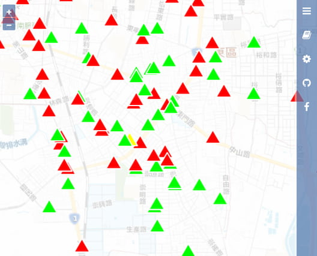
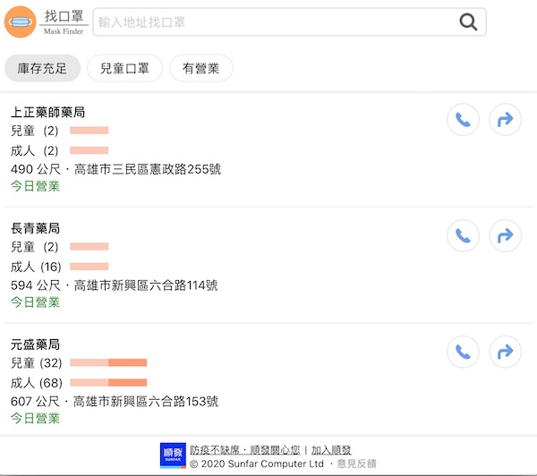



歡迎您運用以下社群朋友開發的應用界面，了解即時的口罩供需情況： 
（ℹ️ 口罩的取得須依政府頒布的規則辦理，<b>手機使用前請開啟定位服務</b>。）

<a href="https://kiang.github.io/pharmacies/"><picture><source type="image/webp" srcset="img/kiang.webp" /><source type="image/jpeg" srcset="img/kiang.jpg" /></picture></a>
### <a href="https://kiang.github.io/pharmacies/">藥局口罩採購地圖</a> by kiang

---

<a href="https://mask.goodideas-studio.com/"><picture><source type="image/webp" srcset="img/gdg.webp" /><source type="image/jpeg" srcset="img/gdg.jpg" /></picture></a>
### <a href="https://mask.goodideas-studio.com/">即時口罩地圖</a> by GDG @ 好想工作室

---

<a href="https://masks.sunfarplus.com.tw"><picture><source type="image/webp" srcset="img/mask-finder.webp" /><source type="image/jpeg" srcset="img/mask-finder.jpg" /></picture></a>
### <a href="https://masks.sunfarplus.com.tw">找口罩 Mask Finder</a> by 順發 SUNFAR+

---

### <a href="https://line.naver.jp/ti/p/@592zrdyn">還有口罩嗎？ (Line ChatBot)</a> by Eric Wu

---

### <a href="https://line.naver.jp/ti/p/@960iorjj">口罩哪裡買 (Line ChatBot)</a> by funtuan

---

### <a href="https://line.me/ti/p/@054ehalj">敗口罩 (Line ChatBot)</a> by Ian Chen

---

### <a href="https://t.me/taiwan_mask_bot">Telegram 我 ok 你先領 by</a> by 抗中保台

---

### <a href="http://bit.ly/2RWtFMG">全臺健保特約藥局剩餘口罩數地圖</a> by 瑞竣科技

---

### <a href="https://gogo.com.tw">口罩地圖 APP</a> by LOOK

---

# <a href="https://lin.ee/nT4IBHS"> LINE SPOT #健保特約藥局 查詢 </a> by LINE TW

---

# <a href="https://t.me/TWMaskFindBot">台灣口罩藥局查詢 (Telegram ChatBot)</a> by neo

---

# <a href="https://kuro.tw/mask-map/">Leaflet map with 藥局資料</a> by kuro

---

# <a href="https://taiwan-health-insurance-contracted-pharmacy.pu.idv.tw/">特約藥局地圖</a> by pupu

---

# <a href="https://wewatch.city/">災情回報系統</a> by 卓騰語言科技

---

# <a href="https://maskcount.herokuapp.com/maps/">健保特約藥局與衛生所地圖</a> by Kevin Chou

---

# <a href="https://map.code6421.cc/">口罩地圖（目前位置半徑 5 公里的點）</a> by code6421

---

# <a href="https://yasco.com.tw/tw/mask.asp">口罩供需即時資訊查詢</a> by 昭惠實業股份有限公司

---

# <a href="https://www.arplanet.com.tw/download/">AR版健保特約藥局與鄉鎮衛生所</a> by marq+

---

# <a href="https://line.me/ti/p/@kin5669r">高雄金城武 (Line ChatBot)</a> by Daniel Wang

---

# <a href="https://page.line.me/taiwancdc">疾管署LINE@「疾管家」</a> by DeepQ

---

# <a href="https://www.codeburnout.net/">口罩追追追 - 歷史供貨與時段數據顯示(Web)</a> by Evan Lyu

---

# <a href="https://line.me/ti/p/@637bgygh">line@口罩小幫手</a> by Harold

---

# <a href="https://taichunmin.idv.tw/pug/ncov-mask-map.html">武漢肺炎藥局口罩地圖</a> by 和風信使

---

# <a href="https://mask.digitvolunteer.space/">台東縣實名制口罩地圖</a> by 東大數位志工

---

# <a href="https://line.me/R/ti/p/%40280owqcw">口罩咧？</a> by tw developer

---

# <a href="https://findmasks.netlify.com">即時口罩銷售查詢 (LINE Bot)</a> by Ming-jun

---

# <a href="https://line.me/ti/p/@901psggh">防疫機器人(Line ChatBot)</a> by APMIC OpenTalk

---

# <a href="https://mask.kyleyu.dev">口罩資訊</a> by 老K

---

# <a href="http://info.getchee.com/Login/Info">特約藥局及口罩量地圖查詢</a> by getchee Inc.

---

# <a href="https://peter279k.github.io/pharmacy/">我要買口罩</a> by peter279k

---

# <a href="https://findmasks.geo.com.tw/">FindMasks.GEO</a> by 巨鷗跨界創新聯盟

---

# <a href="https://lin.ee/hBLv58H">[口罩狀況地圖 LineBot]</a> by 究心公益科技
# <a href="https://geobingan.info/event/mask">[口罩狀況地圖 Web ]</a> by 究心公益科技

---

# <a href="https://line.me/ti/p/@997uqxua">搶先罩 (Line Bot)</a> by Mavis -兒-

---

# <a href="http://line.me/ti/p/@136lwxjn">找口罩 (Line Bot)</a> by 先宏資訊 Andy Hung

---

# <a href="https://test.yallvend.com/vendingmap/index.html">台灣藥局口罩數量地圖</a> by 業安科技 Neil

---

# <a href="https://mask.zxcv.today/">口罩地圖</a> by BillWilson@github

---

# <a href="https://www.icloud.com/shortcuts/b6f50351d4464358a81c8f7339bc9d78?fbclid=IwAR1OOev8QoMblDJ5F-G8TihsCohAAWFSVTHMAkyqwA786BdSZM49V9EX5HA">[Siri] 附近的藥局 (直接問Siri 找出最近有口罩庫存的藥局)</a> by 趨勢科技 山姆大叔

---

# <a href="https://hinablue.me/mask_map/">口罩熱區</a> by @hinablue, 閃光洽


